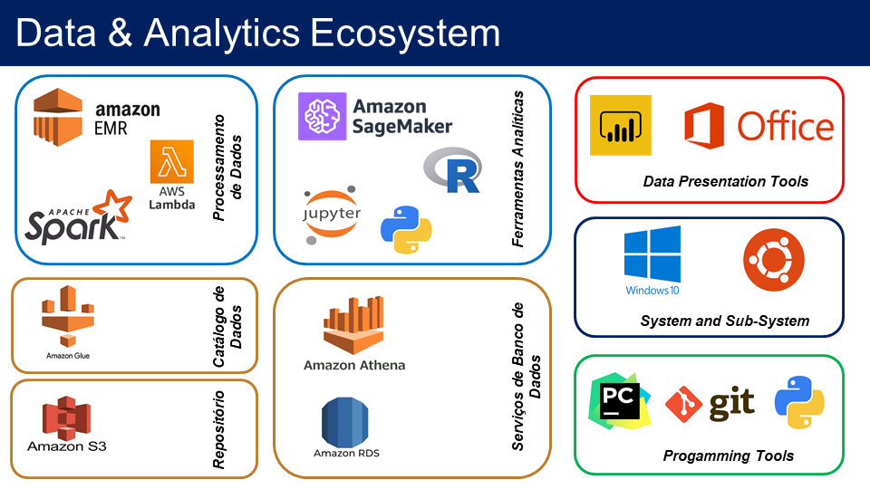

# Arquitetura de Ferramentas de Dados e Análise

A ideia desse documento é criar uma opção de combinação de ferramenas livres e 
comercias para criar um ambiente de processamento, análise e apresentação de dados.

O objetivo é pensar em um ambiente que seja de custo baixa, mas não necessariamente gratuíto e,
que possa ser expandido rapidamente. Dessa forma, pode ser utilizado para um individo,
que é meu caso, até empresas pequenas e médias. Para grandes empresas, seria necessário 
algumas modificações no Git principalmente.

***
# Architecture

I will create a Windows 10 machine with Ubuntu sub system to work with data science stuffs.

An part to create a linux is on:
https://github.com/afonsomy/One_project/blob/master/linux-install.md

