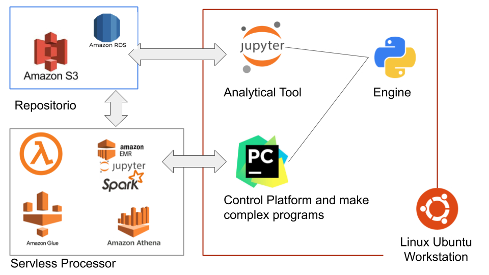

# Data Science and Data Engineer Worsktation Project

I used the knowledge accumulate this last months to create a step by step project can help anyone to create a usefully Linux Ubuntu notebook prepared to use in data science and data engineer projects.

It is a complete environment connecting resources like Python, GitHub, Jupyter, PyCharm and Ubuntu Linux.

***
# Architecture

I will create a Windows 10 machine with Ubuntu sub system to work with data science stuffs.

An part to create a linux is on:
https://github.com/afonsomy/One_project/blob/master/linux-install.md

