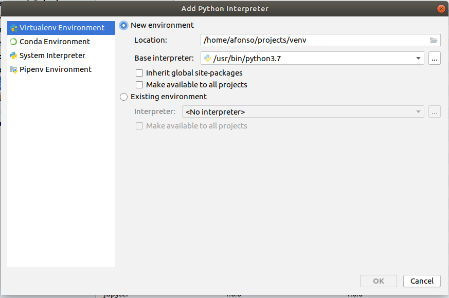

# Personal Projects on GitHub

***
### List of Contents 

1. The Environment - Prepare a notebook with Ubuntu to works a Analytics Workstation
2. Notebooks - Jupyter Projects - Lis of Projects

***
# The Environment 

### Prepare a Linux Ubuntu notebook to works a Analytics Workstation

### 0) Open GitHub and see some instruction that  there are

https://github.com/afonsomy/One_project

### 1) Install Google Chrome

https://www.google.com/chrome/

Download buttton --> will open Ubuntu installer

### 2) GitHub

Install GitHub

$ sudo apt update
$ sudo apt install git
$ git --version

Set Up GitHub

$ git config --global user.name "afonsomy"
$ git config --global user.email "afonsomy@gmail.com"
$ git config --list

Initialize the local directory as a Git repository:

$ mkdir projects
$ cd projects
$ git init

Clone repo:

https://github.com/afonsomy/One_project.git

$ git remote add origin https://github.com/afonsomy/One_project.git
$ git pull origin master

More details to make commits and pull/push manually in command line directly on:
https://help.github.com/en/github/importing-your-projects-to-github/adding-an-existing-project-to-github-using-the-command-line

### 3) Python

#### Install Python

The notebooks in my repository will use Python 3.

##### Check version:

> python ––version

##### Step 1: Update and Refresh Repository Lists

> sudo apt update

##### Step 2: Install Supporting Software

> sudo apt install software-properties-common

##### Step 3: Add Deadsnakes PPA

> sudo add-apt-repository ppa:deadsnakes/ppa

> sudo apt update

##### Step 4: Install Python 3.7

> sudo apt install python3.7

> python3.7 --version

#### Install PIP

Installing PIP by Python 3 on Ubuntu 18.04.

> sudo apt install -y python3-pip

> pip3 install flask

> pip3 --version

#### Install venv tool

venv lets you create virtual environments for your Python 3 projects. A virtual environment is an isolated environment for packages
**venv** is a module that belongs to the standard Python 3 SDK. If it’s not bundled with your Python 3 installation, it can be installed using the following command:

> sudo apt install python3-venv

#### Creating your Python 3 Virtual Environment

You can create a virtual environment using the venv module. In your terminal, run the following command:

> python3 -m venv env

I needs deleter the old env folder with Python 3.6 version.

####  Activating your Python 3 Virtual Environment

> source env/bin/activate

See installed packages.

> pip3 freeze

Install new packages

> pip3 install <packages>

#### Stop environment

> deactivate

Note: based in the webpage (https://www.techiediaries.com/ubuntu-install-python/)

Reference: https://virtualenv.pypa.io/en/latest/index.html

### 4) Jupyter

####  Activating your Python 3 Virtual Environment

> source env/bin/activate

##### Installing using pip classical Notebook

> pip3 install jupyter

check

> jupyter notebook

##### Installing using pip Jupyter Lab

> pip3 install jupyterlab

check

> jupyter lab

References:
> https://jupyter.org/install
> https://towardsdatascience.com/how-to-setup-your-jupyterlab-project-environment-74909dade29b
> https://www.digitalocean.com/community/tutorials/how-to-set-up-jupyter-notebook-with-python-3-on-ubuntu-18-04

Remember that the Jupyter only was installed in virtual environment.

### 5) PyCharm

#### Now we will install PyCharm.

For analytics task normally we will use Jupyter but for more complex Python program meanly to make maintance of GitHub we prefer use PyCharm.

Installing...

> sudo snap install pycharm-community --classic

This way is easy but depends of connectivity of network. The way downloading the files and installing manually is faster than it.

References? 
> https://linuxize.com/post/how-to-install-pycharm-on-ubuntu-18-04/

Check

> Open Pycharm -> open /home/afonso/projetcs

#### Configure PyCharm to works with my GitHub

From the main menu, choose VCS | Import into Version Control | Share Project on GitHub

#### Configure PyCharm to works with my virtual environment Python 3.7

File --> Settings --> Project Interpreter --> Project Interpreter DialogBox (put down) 

Click in config button:

Choose create a new environment or one there exist:

### 6) Install all common Python Packages to Analytics, Data Science and Data Engineer.

We prepared a shell script to install all packages that will necessary to work.

Changed shell script executable:
> chmod +x deploy-python-library-env

Install all packages
> ./deploy-python-library-env

A good material about how shell scripst:

> https://linuxhint.com/30_bash_script_examples/
>
> https://www.learnshell.org/
>

### 7) Oh My Zsh

> https://github.com/ohmyzsh/ohmyzsh

# Notebooks

