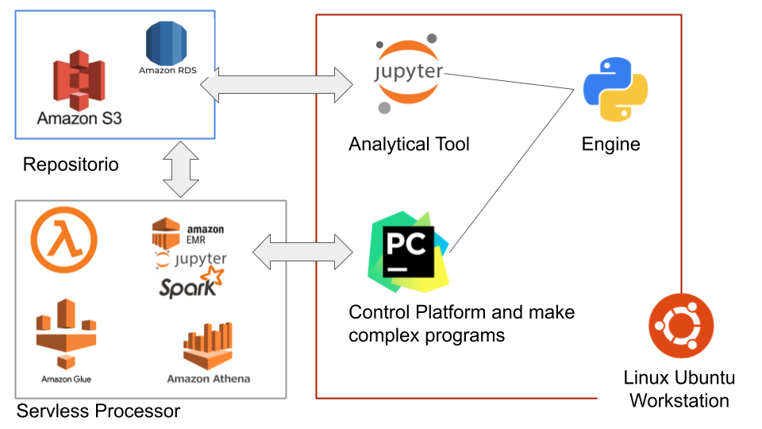
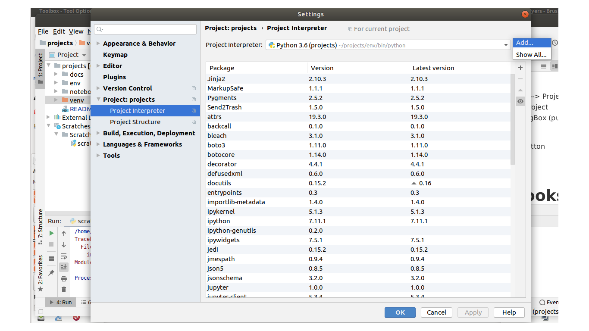
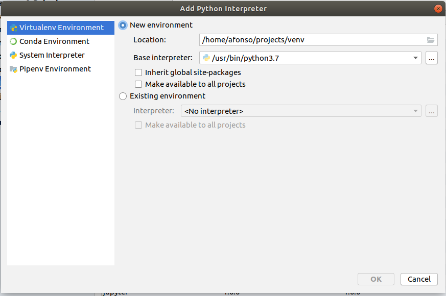

# Data Science and Data Engineer Worsktation Project

I used the knowledge accumulate this last months to create a step by step project can help anyone to create a usefully Linux Ubuntu notebook prepared to use in data science and data engineer projects.

It is a complete environment connecting resources like Python, GitHub, Jupyter, PyCharm and Ubuntu Linux.

***
# Architecture



We will start creating a Linux Ubuntu workstation. But slowly I will create all architecture planned. 

Vamos refazer isso!!!

***
# List of Contents 

1. The Environment - Prepare a notebook with Ubuntu to works a Analytics Workstation
2. AWS Stuffs
3. Notebooks - Jupyter Projects - List of Projects


***
# 1. The Environment 

### Prepare a Linux Ubuntu notebook to works a Analytics Workstation

### 0) Open GitHub and see some instruction that  there are

https://github.com/afonsomy/One_project

***
### 1) Install Google Chrome

https://www.google.com/chrome/

Download buttton --> will open Ubuntu installer

***
### 2) GitHub

Install GitHub

```
$ sudo apt update
$ sudo apt install git
$ git --version
```
Set Up GitHub

```
$ git config --global user.name "afonsomy"
$ git config --global user.email "afonsomy@gmail.com"
$ git config --list
```

Initialize the local directory as a Git repository:

```
$ mkdir projects
$ cd projects
$ git init
```

Clone repo:

https://github.com/afonsomy/One_project.git

```
$ git remote add origin https://github.com/afonsomy/One_project.git
$ git pull origin master
```

More details to make commits and pull/push manually in command line directly on:
https://help.github.com/en/github/importing-your-projects-to-github/adding-an-existing-project-to-github-using-the-command-line

***
### 3) Python

### Installing Python and Jupyter using a shell script file

We create a shell script to install Python 3 and Virtual Environment and Jupyter on the fly:

Will be necessary make the file executable:

``
$ chmod +x deploy-python-jupyter.sh
``


After that execute de shell script below:

``
 $ ./deploy-python-jupyter.sh
``

For more manually way see below:

#### Install Python

The notebooks in my repository will use Python 3.

##### Check version:

```
python ––version
```

##### Step 1: Update and Refresh Repository Lists

```
sudo apt update
```

##### Step 2: Install Supporting Software

```
sudo apt install software-properties-common
```

##### Step 3: Add Deadsnakes PPA

```
sudo add-apt-repository ppa:deadsnakes/ppa

sudo apt update
```

##### Step 4: Install Python 3

```
sudo apt install python3.7

python3.7 --version
```

***
#### Install PIP

Installing PIP by Python 3 on Ubuntu 19.10.
```
sudo apt install -y python3-pip

pip3 install flask

pip3 --version
```

#### Install venv tool

venv lets you create virtual environments for your Python 3 projects. A virtual environment is an isolated environment for packages
**venv** is a module that belongs to the standard Python 3 SDK. If it’s not bundled with your Python 3 installation, it can be installed using the following command:

```
sudo apt install python3-venv
```

#### Creating your Python 3 Virtual Environment

You can create a virtual environment using the venv module. In your terminal, run the following command:
```
python3 -m venv env
```

####  Activating your Python 3 Virtual Environment
```
source env/bin/activate
```

See installed packages.
```
pip3 freeze
```

Install new packages
```
pip3 install <packages>
```

#### Stop environment
```
deactivate
```

Note: based in the webpage (https://www.techiediaries.com/ubuntu-install-python/)

Reference: https://virtualenv.pypa.io/en/latest/index.html

***
### 4) Jupyter

####  Activating your Python 3 Virtual Environment
```
source env/bin/activate
```

##### Installing using pip classical Notebook

```
pip3 install jupyter
```

check
```
jupyter notebook
```


##### Installing using pip Jupyter Lab

```
pip3 install jupyterlab
```

check

```
jupyter lab
```


References:
> https://jupyter.org/install
> https://towardsdatascience.com/how-to-setup-your-jupyterlab-project-environment-74909dade29b
> https://www.digitalocean.com/community/tutorials/how-to-set-up-jupyter-notebook-with-python-3-on-ubuntu-18-04

Remember that the Jupyter only was installed in virtual environment.


***
### 5) PyCharm

#### Now we will install PyCharm.

For analytics task normally we will use Jupyter but for more complex Python program and to make maintance of GitHub we prefer use PyCharm.
Let's see how is it:


#### Installing using sudo
```
sudo snap install pycharm-community --classic
```

This way is easy but depends of connectivity of network. The way downloading the files and installing manually is faster than it.

References:
> https://linuxize.com/post/how-to-install-pycharm-on-ubuntu-18-04/

Check

```
-> Open Pycharm -> open /home/afonso/projetcs
```

#### Configure PyCharm to works with my GitHub

From the main menu, choose VCS | Import into Version Control | Share Project on GitHub


#### Configure PyCharm to works with my virtual environment Python 3.7

```
File --> Settings --> Project Interpreter --> Project Interpreter DialogBox (put down) 
```

Click in config button:



Choose create a new environment or one there exist:



### 6) Install all common Python Packages to Analytics, Data Science and Data Engineer.

We prepared a shell script to install all packages that will necessary to work.

Changed shell script executable:
```
chmod +x deploy-python-library-env
```

Install all packages
```
./deploy-python-library-env
```

A good material about how shell scripst:

> https://linuxhint.com/30_bash_script_examples/
>
> https://www.learnshell.org/
>

***
### 7) Oh My Zsh

We will install a new shell more interisting that traditional bash.

Installing zhs:
```
sudo apt install zsh
```

Check shell installed:
```
zsh --version
```

Make it your default shell: 
```
chsh -s $(which zsh)
```

Check it:
```
apropos shell | grep sh | \
  sed 's/ .*//;s/.*/which &/e;/^\/bin\//!d;s/.*/realpath &/e;/^\/bin\//!d' | \
  sort -u | xargs whatis
```

Install curl and wget, if necessary:
```
sudo apt install curl
sudo apt install wget
```

Installing Oh My Zsh:

```
 sh -c "$(wget -O- https://raw.githubusercontent.com/ohmyzsh/ohmyzsh/master/tools/install.sh)"

 curl -Lo install.sh https://raw.githubusercontent.com/ohmyzsh/ohmyzsh/master/tools/install.sh

 sh install.sh
```

Maybe we needs restarting the notebook to change.
After that we can check:
```
echo $SHELL
```


Reference material:

> https://github.com/ohmyzsh/ohmyzsh

> https://github.com/ohmyzsh/ohmyzsh/wiki/Installing-ZSH

***
# 2. AWS Stuffs

We install aws client to connect in S3 bucket to put someting or get something.

Install aws-cli:
```
sudo apt-get install awscli

aws --version
```

An user must be created in IAM console. For security we not show this part. Details could be see in:
> https://docs.aws.amazon.com/IAM/latest/UserGuide/id_users_create.html#id_users_create_cliwpsapi


Configure access:

> aws configure
>
>> AWS Access Key ID [None]: xxxx
>>
>> AWS Secret Access Key [None]: xxxx
>>
>> Default region name [None]: "aws region"
>>
>> Default output format [None]: "Name"
 
List files in S3 bucket:

> aws s3 ls s3://"Your Bucket Name"
>


***
# 3. Notebooks


```

Install the package to uso export PDF on Jupyter Notebook

sudo apt-get install texlive-xetex

```

# 4. RSudio

Installing using shell script 

'''

~projects $ ./install_rstudio.sh

'''


